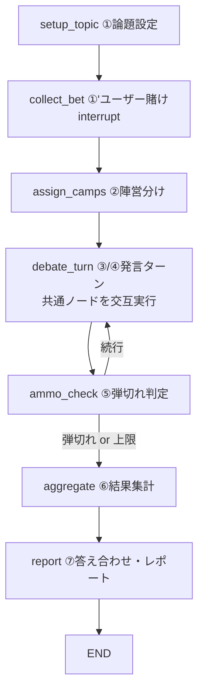

# 反証探索ディベートRAG — LangGraph ノード詳細設計

草案 (`生成AIアプリ草案.md`) のノードグラフ (①〜⑦) を、実装可能な粒度まで分解した設計書。

> **実装粒度の設計書(実習①準拠・ファイル単位/関数単位)は `design/` フォルダを参照。**
> 本ファイルはコンセプト設計(なぜこの構成か)として残す。一部(interrupt の使用など)は
> `design/` 側で実習の流儀(`input()` ノード + 条件分岐エッジ)に置き換えている。

---

## 0. 全体像



設計上のポイント:

- 草案の「③発言者RAG」「④相手方RAG」は**処理が完全に対称**なので、1つの `debate_turn` ノードに統合し、State の `current_speaker` で立場を切り替える。ノード実装が1本になりバグが減る。
- 「弾切れ」は草案の懸念点(*何度検索しても同じ回答では?*)に直結するので、**使用済み文書の除外**と**新規性スコア**の2段構えで判定する(⑤参照)。
- ユーザー入力(論題・賭け)は LangGraph の `interrupt()` で受け取る(人間介在ポイント)。

---

## 1. State 定義

全ノードが読み書きする共有状態。実装は `TypedDict` + `Annotated` リデューサ。

```python
class Evidence(TypedDict):
    doc_id: str          # ベクトルストア上のチャンクID
    source: str          # 出典(ファイル名・URL)
    quote: str           # 引用箇所
    novelty: float       # 既出論拠との最大類似度から算出した新規性 (0-1)

class Turn(TypedDict):
    turn_no: int
    speaker: Literal["pro", "con"]
    target_claim: str    # 反論対象とした相手の主張
    query: str           # 実際に投げた検索クエリ
    claim: str           # 生成した反論主張
    evidences: list[Evidence]

class DebateState(TypedDict):
    # --- セットアップ ---
    topic: str                       # 論題(例: 地球温暖化は進んでいるか)
    stance_pro: str                  # 肯定側の立場文
    stance_con: str                  # 否定側の立場文
    user_bet: Literal["pro", "con"]  # ユーザーの勝敗予想

    # --- ディベート進行 ---
    current_speaker: Literal["pro", "con"]
    turns: Annotated[list[Turn], operator.add]   # 発言履歴(追記型)
    used_doc_ids: dict[str, list[str]]           # {"pro": [...], "con": [...]}
    turn_count: int
    max_turns: int                               # 安全上限(例: 12)

    # --- 弾切れ管理 ---
    dry_streak: dict[str, int]       # 陣営ごとの「新規文書なし」連続回数
    exhausted: dict[str, bool]       # 陣営ごとの弾切れフラグ
    end_reason: str                  # "both_exhausted" | "max_turns" | ""

    # --- 結果 ---
    scores: dict                     # ⑥の集計結果
    winner: Literal["pro", "con", "draw"]
    report: str                      # ⑦の最終レポート(Markdown)
```

---

## 2. ノード詳細

### ① `setup_topic` — 論題設定

**入力:** ユーザーの論題文字列(グラフ起動時の入力)
**出力:** `topic`, `stance_pro`, `stance_con`

処理ステップ:

1. **論題の正規化** — LLM で「Yes/No で立場が分かれる命題文」に書き換える。
   例:「地球温暖化ってどうなの」→「地球温暖化は人為的要因で進行している」
2. **立場文の生成** — 命題から肯定側・否定側それぞれの立場文(1文)を生成。
3. **ディベート可能性チェック(重要)** — 草案の懸念「*対立する意見をソースに含まないといけない*」への対策。
   両立場文でそれぞれベクトル検索を1回ずつ実行し、双方に類似度 ≥ 閾値のヒットが k 件以上あるか確認。
   - 片側にしか資料がない場合 → その旨をユーザーに提示し、論題の変更を促して終了(あるいは interrupt で再入力)。

プロンプト方針: 「命題化」「立場文生成」「検索クエリ化」は 1 回の structured output (JSON) でまとめて取得してよい。

### ①' `collect_bet` — ユーザーの賭け

**入力:** `topic`, `stance_pro`, `stance_con`
**出力:** `user_bet`

1. `interrupt()` で「どちらのAIが勝つと思う?」を提示し、`pro` / `con` の選択を受け取る。
2. State に保存。**ディベート結果には一切影響させない**(観戦者としての賭け)。

> ノードを ① と分けるのは、interrupt 再開時に ① の LLM 呼び出しを再実行しないため。

### ② `assign_camps` — 陣営分け・初期化

**入力:** セットアップ済み State
**出力:** ディベート進行用フィールドの初期値

1. AI-A ← `stance_pro`、AI-B ← `stance_con` を割り当て(固定でよい。ランダム化するならここ)。
2. `current_speaker = "pro"`(先攻)、`turn_count = 0`、`used_doc_ids`・`dry_streak`・`exhausted` を空で初期化。
3. 先攻の最初の反論対象がないため、**初回ターン用の「立論」** として `target_claim = stance_con`(相手の立場文そのもの)をセットする。

LLM 呼び出しなし(純粋な State 初期化ノード)。

### ③/④ `debate_turn` — 発言ターン(共通ノード)

**入力:** `current_speaker`, 直前の相手 Turn, `used_doc_ids`
**出力:** 新しい `Turn` を `turns` に追記、`used_doc_ids` 更新、`current_speaker` 交代

内部を4サブステップに分解(実装は1ノード内の関数分割、または LangGraph のサブグラフ):

**(a) 反論対象の抽出**
- 相手の直前 Turn の `claim` から、反論すべき中心主張を1文で抽出(LLM)。
- 初回は `target_claim`(相手の立場文)をそのまま使う。

**(b) 反証クエリ生成**
- 「`target_claim` に反する証拠を探す」検索クエリを LLM で 2〜3 本生成。
- 草案の懸念「*ずっと同じ反証しか出ないのでは*」への対策として、**既出論拠の要約をプロンプトに入れ、「これらとは異なる角度の反証」を明示的に要求**する(角度例: 統計データ / 因果関係 / 事例 / 方法論批判)。

**(c) 検索 + 新規性フィルタ**
1. 各クエリでベクトル検索(k=5程度)。
2. `used_doc_ids[speaker]` に含まれるチャンクは**除外**(同じ弾は二度撃てない)。
3. 残った候補それぞれについて、自陣営の既出 Evidence 埋め込みとの最大コサイン類似度 `s` を計算し、`novelty = 1 - s` を付与。
4. `novelty ≥ 0.15`(調整パラメータ)かつ立場適合(次項)の上位 1〜2 件を採用。
5. **立場適合チェック(LLM)**: チャンクが本当に自陣営を支持する内容か Yes/No 判定。RAGコーパスは両論混在なので、検索ヒット=味方の証拠ではない。

**(d) 反論生成**
- 採用 Evidence のみを根拠に、相手の `target_claim` への反論を生成(LLM)。
- 制約: 引用必須(`[出典]` 形式)・Evidence にない主張の禁止・150〜250字。
- Turn オブジェクトを組み立てて `turns` に追記、`doc_id` を `used_doc_ids` に登録。

**採用 Evidence が 0 件だった場合**: 反論を生成せず、`Turn` に `evidences=[]` の「パス」を記録し、`dry_streak[speaker] += 1`。これが⑤の判定材料になる。

### ⑤ `ammo_check` — 弾切れ判定(条件分岐エッジ)

**入力:** 直前の Turn, `dry_streak`, `turn_count`
**出力:** ルーティング先(`debate_turn` に戻る / `aggregate` へ)

判定ロジック(LLM 不使用、ルールベース):

```
1. 直前ターンで Evidence が採用された
      → dry_streak[speaker] = 0
   採用 0 件(パス)だった
      → dry_streak[speaker] += 1
      → dry_streak[speaker] >= 2 なら exhausted[speaker] = True
2. 終了条件チェック:
   - 両陣営 exhausted            → end_reason = "both_exhausted" → aggregate へ
   - turn_count >= max_turns     → end_reason = "max_turns"      → aggregate へ
3. 続行の場合:
   - current_speaker を交代(ただし相手が exhausted なら自分の連続ターン)
   - turn_count += 1 して debate_turn へ
```

> 片方だけ弾切れの場合、もう片方は撃ち続けられる限り続行する(論拠数の差がそのまま⑥のスコア差になる)。

### ⑥ `aggregate` — 結果集計

**入力:** `turns`, `end_reason`
**出力:** `scores`, `winner`

1. **定量集計(主指標)**: 陣営ごとに
   - 有効論拠数(採用 Evidence の総数)
   - 平均 novelty(角度の多様さ)
   - パス回数
2. **勝敗決定**: 有効論拠数の多い側が勝ち。同数なら平均 novelty、それも同等なら draw。
3. 草案の懸念「*ジャッジAIを作るのも違う*」への回答: **勝敗はルールベースの数勘定で決める**(=「リソースから反証が出なくなるまで探させる」方式そのもの)。LLM は使わないので判定の恣意性がない。
   - オプション: LLM による「各論拠の質コメント」を⑦の解説用に生成するのは可(勝敗には使わない)。

### ⑦ `report` — 答え合わせ・レポート

**入力:** State 全体
**出力:** `report`(Markdown)

1. **答え合わせ**: `user_bet` と `winner` を照合し、的中/外れを冒頭に表示。
2. **試合サマリ(LLM)**: `turns` を時系列で要約し、各陣営の主要論点を 3 点ずつに整理(草案の「5. 論点整理」に相当)。
3. **論拠一覧**: 全 Evidence を出典付きで列挙(ユーザーが原典を確認できるように)。
4. **バランス注記(重要)**: 草案の懸念「*過信 / 自信喪失*」への対策。
   - 「このディベートは与えられたコーパス内の資料に限定した結果であり、現実の結論ではない」旨の定型注記を必ず含める。
   - 負けた側の最良論拠 1 件をハイライトし、「一方的な決着ではない」ことを見せる。

---

## 3. グラフ構築コード骨子

```python
builder = StateGraph(DebateState)
builder.add_node("setup_topic", setup_topic)
builder.add_node("collect_bet", collect_bet)      # interrupt あり
builder.add_node("assign_camps", assign_camps)
builder.add_node("debate_turn", debate_turn)
builder.add_node("aggregate", aggregate)
builder.add_node("report", report)

builder.add_edge(START, "setup_topic")
builder.add_edge("setup_topic", "collect_bet")
builder.add_edge("collect_bet", "assign_camps")
builder.add_edge("assign_camps", "debate_turn")
builder.add_conditional_edges(
    "debate_turn",
    ammo_check,                       # ⑤は関数(条件分岐)として実装
    {"continue": "debate_turn", "finish": "aggregate"},
)
builder.add_edge("aggregate", "report")
builder.add_edge("report", END)

graph = builder.compile(checkpointer=MemorySaver())  # interrupt に必須
```

---

## 4. ノード外の前提(RAG 基盤)

| 項目 | 方針 |
|---|---|
| コーパス | 両論を含む文書集合が必須。論題ごとに賛否双方の資料を投入(①のチェックで担保) |
| チャンク | 300〜500字 + オーバーラップ。チャンクごとに `doc_id` / `source` をメタデータ保持 |
| ベクトルストア | Chroma(ローカル・軽量)で開始 |
| 埋め込み | 多言語対応モデル(日本語資料前提) |
| LLM 呼び出し箇所 | ①命題化、③/④の (a)(b)(d) と立場適合判定、⑥質コメント(任意)、⑦サマリ |
| UI | まずは CLI で `interrupt` 動作確認 → Streamlit 化 |

## 5. 調整パラメータ一覧

| パラメータ | 初期値 | 役割 |
|---|---|---|
| `max_turns` | 12 | 無限ループ防止の安全上限 |
| 検索 k | 5 | 1クエリあたりの候補数 |
| novelty 閾値 | 0.15 | 「同じ反証の繰り返し」排除の強さ |
| `dry_streak` 上限 | 2 | 何回連続パスで弾切れとみなすか |
| ①のヒット下限 | 3件 | ディベート可能性チェックの基準 |
