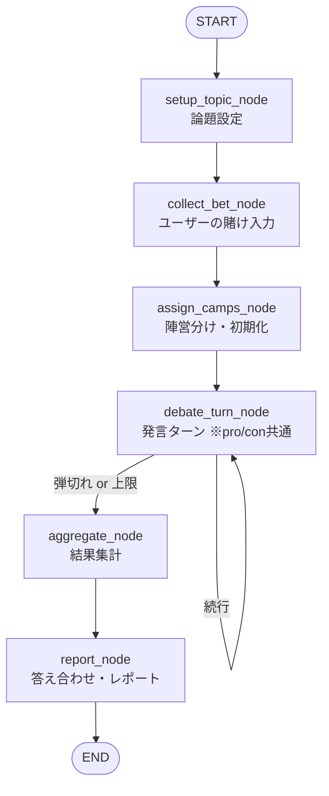

# 反証探索ディベートRAG — 全体構成

実習①「レポート作成アプリ」(`e5_report_agent`) と同じ流儀で、
草案 (`生成AIアプリ草案.md`) のディベートアプリを構成する設計書。

- コンセプト設計(なぜこの構成か)は `../LangGraphノード設計.md` を参照
- 本フォルダは **実装粒度**(ファイル単位・関数単位)の設計書

---

## 1. ワークフロー



- 草案の「③発言者RAG」「④相手方RAG」は処理が対称なので
  **`debate_turn_node` 1本に統合**し、State の `current_speaker` で立場を切り替える。
- 草案の「⑤弾切れ判定」はノードではなく、
  **条件分岐エッジの判定関数 `judge_continue`** として実装する
  (実習①完成版の「中止/修正/OK」分岐と同じ仕組み)。

## 2. プロジェクト構成

実習①の `e5_report_agent` と同じ形。パッケージ名は `debate_agent`。

```
PythonProject/
└─ debate_agent/                 … 今回のパッケージ
   ├─ chroma_db/                 … ベクトルストア(make_vector_db.pyが生成)
   ├─ nodes/                     … ノードを入れるパッケージ
   │   ├─ setup_topic_node.py    … 論題設定ノード
   │   ├─ collect_bet_node.py    … 賭け入力ノード
   │   ├─ assign_camps_node.py   … 陣営分けノード
   │   ├─ debate_turn_node.py    … 発言ターンノード(pro/con共通)
   │   ├─ aggregate_node.py      … 結果集計ノード
   │   └─ report_node.py         … レポートノード
   ├─ make_vector_db.py          … ベクトルストア生成プログラム(実習のものを流用)
   ├─ debate_state.py            … Stateクラス
   ├─ debate_graph.py            … グラフ作成プログラム(judge_continueもここ)
   ├─ debate_main.py             … メインプログラム
   └─ (資料PDF)                  … 賛否両論を含む文書を複数入れる
```

## 3. State (`debate_state.py`)

ノードへの入力パラメータ・戻り値・その他必要な変数の入れ物。

```python
from typing import TypedDict


class DebateState(TypedDict):
    # --- セットアップ ---
    topic: str            # 論題(ユーザー入力を命題文に正規化したもの)
    stance_pro: str       # 肯定側の立場文
    stance_con: str       # 否定側の立場文
    user_bet: str         # ユーザーの勝敗予想 "pro" or "con"

    # --- ディベート進行 ---
    current_speaker: str  # いま発言する側 "pro" or "con"
    turns: list           # 発言履歴(1発言 = dict、下記「turnsの中身」参照)
    used_doc_ids: dict    # 使用済みチャンクID {"pro": [...], "con": [...]}
    dry_streak: dict      # 新規論拠なしの連続回数 {"pro": 0, "con": 0}
    turn_count: int       # 現在のターン数
    max_turns: int        # 安全上限(例: 12)
    end_reason: str       # 終了理由 "both_exhausted" / "max_turns" / ""

    # --- 結果 ---
    scores: dict          # 集計結果(陣営ごとの論拠数など)
    winner: str           # "pro" / "con" / "draw"
    report: str           # 最終レポート(Markdown文字列)
```

### turns の中身(1発言分の dict)

```python
{
    "turn_no": 1,             # 何ターン目か
    "speaker": "pro",         # 発言者
    "target_claim": "...",    # 反論対象にした相手の主張
    "query": "...",           # 実際に投げた検索クエリ
    "claim": "...",           # 生成した反論主張(引用つき)
    "evidences": [            # 採用した論拠(0件なら「パス」)
        {"doc_id": "...", "source": "...", "page": "...", "quote": "..."},
    ],
}
```

## 4. State と各ノードの対応(どのノードが何を読み書きするか)

| ノード | Stateから取り出す(入力) | returnする(戻り値) |
|---|---|---|
| setup_topic_node | topic(ユーザー入力の生文字列) | topic, stance_pro, stance_con |
| collect_bet_node | topic, stance_pro, stance_con | user_bet |
| assign_camps_node | stance_pro, stance_con | current_speaker, turns, used_doc_ids, dry_streak, turn_count, max_turns, end_reason |
| debate_turn_node | current_speaker, turns, used_doc_ids, dry_streak, turn_count, stance_pro, stance_con | turns, used_doc_ids, dry_streak, current_speaker, turn_count, end_reason |
| (judge_continue) | end_reason を見るだけ | ―(分岐先を返す判定関数) |
| aggregate_node | turns, end_reason | scores, winner |
| report_node | ほぼ全部 | report |

## 5. グラフ (`debate_graph.py`)

```python
from langchain_chroma import Chroma
from langgraph.graph import StateGraph, START, END

from debate_agent.nodes.setup_topic_node import create_setup_topic_node
from debate_agent.nodes.collect_bet_node import create_collect_bet_node
from debate_agent.nodes.assign_camps_node import create_assign_camps_node
from debate_agent.nodes.debate_turn_node import create_debate_turn_node
from debate_agent.nodes.aggregate_node import create_aggregate_node
from debate_agent.nodes.report_node import create_report_node
from debate_agent.debate_state import DebateState


def judge_continue(state: DebateState) -> str:
    """弾切れ判定(草案の⑤)。debate_turn_nodeのあとの分岐先を決める"""
    if state["end_reason"] != "":     # debate_turn_nodeが終了理由をセット済みなら
        return "finish"               # 集計へ
    return "continue"                 # まだ弾があるので次のターンへ


def create_debate_graph(llm, vectorstore: Chroma):
    builder = StateGraph(DebateState)

    # ノードを登録(vectorstoreやllmはエージェント実行中に変化しないので
    # create_xxx_node の入力パラメータとして与える)
    builder.add_node("setup_topic", create_setup_topic_node(llm, vectorstore))
    builder.add_node("collect_bet", create_collect_bet_node())
    builder.add_node("assign_camps", create_assign_camps_node())
    builder.add_node("debate_turn", create_debate_turn_node(llm, vectorstore))
    builder.add_node("aggregate", create_aggregate_node())
    builder.add_node("report", create_report_node(llm))

    # エッジを登録
    builder.add_edge(START, "setup_topic")
    builder.add_edge("setup_topic", "collect_bet")
    builder.add_edge("collect_bet", "assign_camps")
    builder.add_edge("assign_camps", "debate_turn")
    builder.add_conditional_edges(
        "debate_turn",
        judge_continue,
        {
            "continue": "debate_turn",   # ループ(次の発言ターン)
            "finish": "aggregate",       # 弾切れ or 上限 → 集計へ
        },
    )
    builder.add_edge("aggregate", "report")
    builder.add_edge("report", END)

    return builder.compile()
```

> ループがあるため、実行時に LangGraph の再帰上限(既定25)に当たることがある。
> `graph.invoke(initial_state, {"recursion_limit": 50})` のように余裕を持たせる。

## 6. メインプログラム (`debate_main.py`)

```python
from pathlib import Path
from dotenv import load_dotenv

from langchain_chroma import Chroma
from langchain_huggingface import HuggingFaceEmbeddings
from langchain_openai import ChatOpenAI   # 実習で使ったLLMに合わせて変更

from debate_agent.debate_graph import create_debate_graph
from debate_agent.debate_state import DebateState

load_dotenv()                             # APIキーを読み込む

PROJECT_DIR = Path(__file__).resolve().parent
DB_DIR = PROJECT_DIR / "chroma_db"        # ベクトルストアの場所
COLLECTION_NAME = "debate_docs"           # コレクション名


def main():
    # 埋め込みツールを生成(実習①と同じモデル)
    embeddings = HuggingFaceEmbeddings(
        model_name=(
            "sentence-transformers/"
            "paraphrase-multilingual-MiniLM-L12-v2"
        )
    )

    # ベクトルストア操作ツールを生成
    vectorstore = Chroma(
        persist_directory=str(DB_DIR),
        embedding_function=embeddings,
        collection_name=COLLECTION_NAME,
    )

    # LLMを生成
    llm = ChatOpenAI(model="gpt-4o-mini", temperature=0.3)

    # グラフを生成
    graph = create_debate_graph(llm=llm, vectorstore=vectorstore)

    # 論題を設定(ユーザー入力)
    topic = input("論題を入力してください(例: 地球温暖化は進んでいる?): ")

    # DebateStateの初期状態を設定
    initial_state: DebateState = {
        "topic": topic,
        "stance_pro": "", "stance_con": "", "user_bet": "",
        "current_speaker": "", "turns": [],
        "used_doc_ids": {}, "dry_streak": {},
        "turn_count": 0, "max_turns": 12, "end_reason": "",
        "scores": {}, "winner": "", "report": "",
    }

    # 初期状態を与えて、グラフを実行
    final_state = graph.invoke(initial_state, {"recursion_limit": 50})

    print("\n処理が完了しました")
    print(final_state["report"])          # 最終レポートを表示


if __name__ == "__main__":
    main()
```

## 7. ベクトルストア生成 (`make_vector_db.py`)

実習①のものを流用。変更点は以下のみ:

- 読み込むPDFを1つ→複数に(**賛成側・反対側の資料を必ず両方入れる**)
- `COLLECTION_NAME = "debate_docs"` に変更
- チャンクのメタデータに `source`(ファイル名)と `page_label` が入ることを確認
  (debate_turn_node が出典表示に使う)

## 8. ノード設計書の一覧

| ファイル | ノード | 草案の対応 |
|---|---|---|
| [01_setup_topic_node.md](01_setup_topic_node.md) | setup_topic_node | ① 論題設定 |
| [02_collect_bet_node.md](02_collect_bet_node.md) | collect_bet_node | ① 立場選択(賭け) |
| [03_assign_camps_node.md](03_assign_camps_node.md) | assign_camps_node | ② 陣営分け |
| [04_debate_turn_node.md](04_debate_turn_node.md) | debate_turn_node | ③④ 発言者RAG/相手方RAG |
| [05_judge_continue.md](05_judge_continue.md) | judge_continue(分岐関数) | ⑤ 弾切れ判定 |
| [06_aggregate_node.md](06_aggregate_node.md) | aggregate_node | ⑥ 結果集計 |
| [07_report_node.md](07_report_node.md) | report_node | ⑦ 答え合わせ・レポート |
