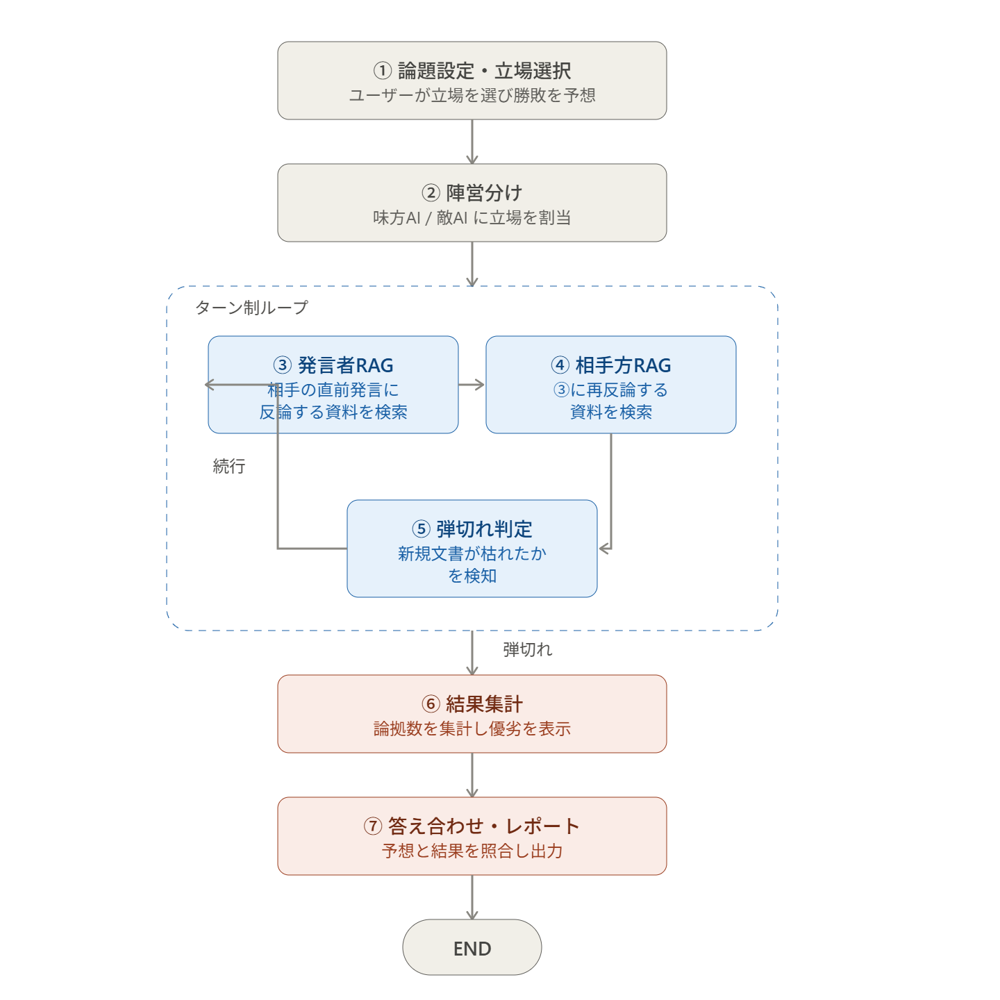

# 生成AIアプリ（アプリアイデア）

- Claude と対話
    - 「反証探索型」のRAG
        - 対立するような意見を意図的に探り出して
        - 批判的に評価する
        - ディベート能力の向上
    - もう少し深堀
        - どんな構成で実装するか
            1. 主張の理解
            2. 視点生成
            3. 探索
            4. 偏り検査
                1. 偏っていたら3へもどる
            5. 論点整理
            6. 提示
    - 懸念点
        - 対立する意見をソースに含まないといけない
        - 反対意見がなくなった時、ユーザーが過信しすぎる可能性がある
        - 逆に反対意見ばかり言われてしまえばユーザーの自信喪失にもなる
    - 解決案
        - ゲーム形式にする（エンタメへの昇華）
            - AI同士に議論をさせる
                - 例：地球温暖化は進んでる？
            - 初めにユーザーに賭けをさせる
                - どっちのAIが勝つ？
    - 懸念点
        - ジャッジってどうしよう？
            - ジャッジするためのAIエージェントみたいなの作るのも違う感じするな
    - 解決案
        - リソースから反対意見つからなくなるまで
        - 探させていけばいいのでは？
    - 懸念点
        - 何度かに分けて反証検索させるのは意味があるのか？
            - 結局、なにかの意見に対する反証意見って、
            - ずっと同じものじゃないか？
            - 何度検索したところで同じ回答しか来なくないか？
    - AIによる推測
        - まあ、リソース次第ではある
            - ある一つの穴（対立意見）を出したとき、これが一つ目の意見とは少しでも違っていればいい
            - そうすればいいかんじでちょっとづつ意見のベクトルがずれていくから
            - リソースがなくなるまでなら延々と議論を重ねられる。
- ざっと生成しノードグラフ
    
    